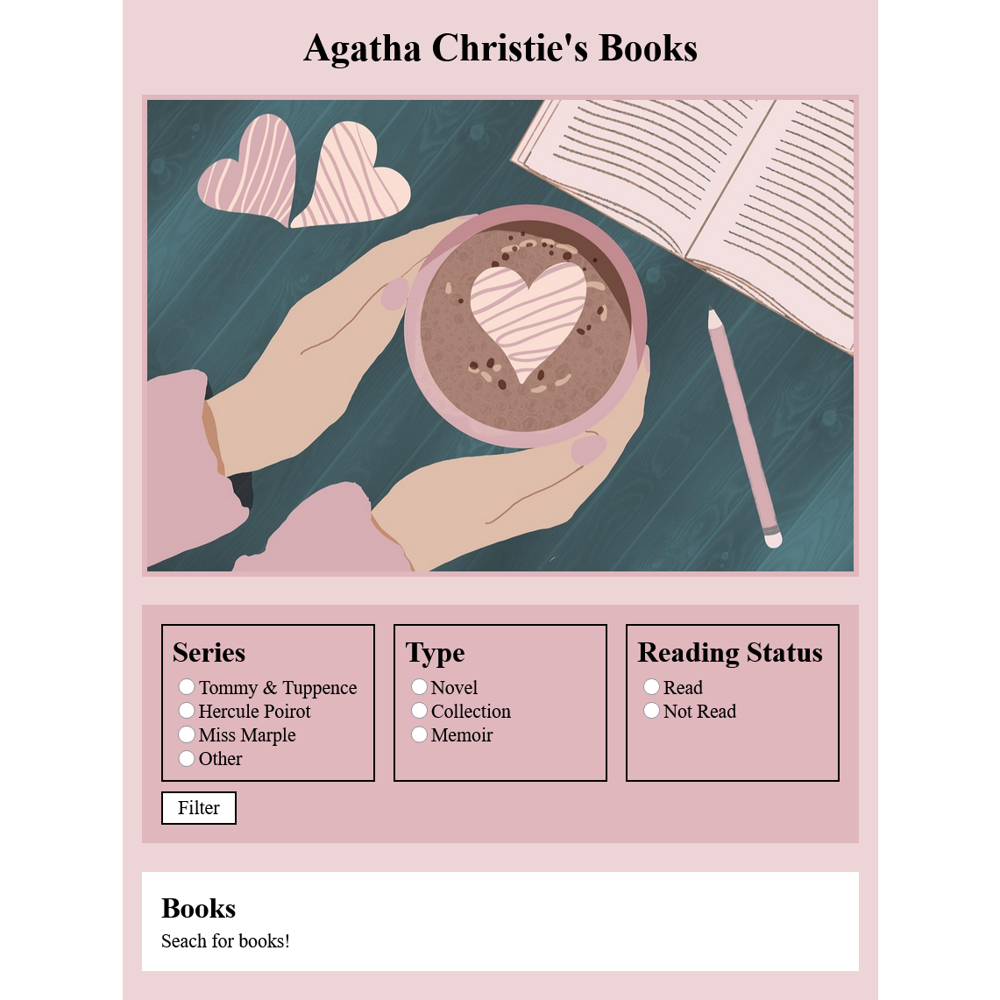

# Agatha Christie's Books 

The purpose of this project was to learn about Flask, a Python micro web framework.

The topic of this project was Agatha Christie's books. I wanted to create a web application to keep track of her books that I have read and to find a new book to read.

In this project, Agatha Christie's book titles are stored in a database. You can filter book titles by series, type, and reading status. If you want to update a book's reading status, you can select the title and click the update button. If a book has been read, the database will store the information and the application will highlight the title.

In the process of developing this project, I learned about:
* Gathering data and developing an SQLite database.
* Querying data from the database with SQL commands.
* Creating a web application with Flask.
* Using Jinja to create a web template and display information from the database.
* Designing a user interface with HTML, CSS, and JavaScript.

Here is a preview of the web application:

